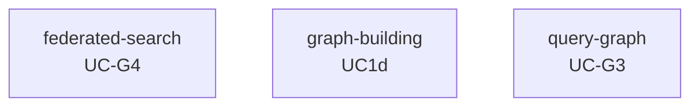

# Process composition: geo-grapher/as-is

Which process calls which (`kind: ref`). Roots: `federated-search`, `graph-building`, `query-graph`.

```mermaid
flowchart TD
  federated_search["federated-search<br/>UC-G4"]
  graph_building["graph-building<br/>UC1d"]
  query_graph["query-graph<br/>UC-G3"]
```
