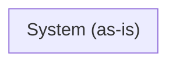

# Use case diagram:  (as-is)

Actors outside the boundary; dashed arrows are «include» and «extend».

```mermaid
flowchart LR
  subgraph system["System (as-is)"]
  end
```

| Use case | Actors | Spec | Status |
|---|---|---|---|
