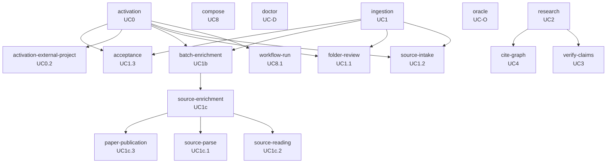

# Process composition: librarian/as-is

Which process calls which (`kind: ref`). Roots: `activation`, `compose`, `doctor`, `ingestion`, `oracle`, `research`.

```mermaid
flowchart TD
  acceptance["acceptance<br/>UC1.3"]
  activation_external_project["activation-external-project<br/>UC0.2"]
  activation["activation<br/>UC0"]
  batch_enrichment["batch-enrichment<br/>UC1b"]
  cite_graph["cite-graph<br/>UC4"]
  compose["compose<br/>UC8"]
  doctor["doctor<br/>UC-D"]
  folder_review["folder-review<br/>UC1.1"]
  ingestion["ingestion<br/>UC1"]
  oracle["oracle<br/>UC-O"]
  paper_publication["paper-publication<br/>UC1c.3"]
  research["research<br/>UC2"]
  source_enrichment["source-enrichment<br/>UC1c"]
  source_intake["source-intake<br/>UC1.2"]
  source_parse["source-parse<br/>UC1c.1"]
  source_reading["source-reading<br/>UC1c.2"]
  verify_claims["verify-claims<br/>UC3"]
  workflow_run["workflow-run<br/>UC8.1"]
  activation --> acceptance
  activation --> activation_external_project
  activation --> batch_enrichment
  activation --> folder_review
  activation --> source_intake
  activation --> workflow_run
  batch_enrichment --> source_enrichment
  ingestion --> acceptance
  ingestion --> batch_enrichment
  ingestion --> folder_review
  ingestion --> source_intake
  research --> cite_graph
  research --> verify_claims
  source_enrichment --> paper_publication
  source_enrichment --> source_parse
  source_enrichment --> source_reading
```
