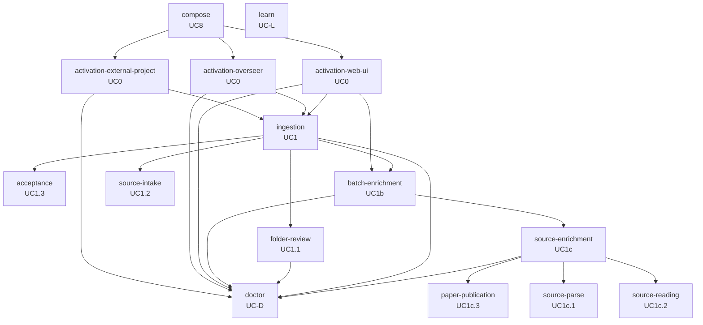

# Process composition: librarian/to-be

Which process calls which (`kind: ref`). Roots: `compose`, `learn`.

```mermaid
flowchart TD
  acceptance["acceptance<br/>UC1.3"]
  activation_external_project["activation-external-project<br/>UC0"]
  activation_overseer["activation-overseer<br/>UC0"]
  activation_web_ui["activation-web-ui<br/>UC0"]
  batch_enrichment["batch-enrichment<br/>UC1b"]
  compose["compose<br/>UC8"]
  doctor["doctor<br/>UC-D"]
  folder_review["folder-review<br/>UC1.1"]
  ingestion["ingestion<br/>UC1"]
  learn["learn<br/>UC-L"]
  paper_publication["paper-publication<br/>UC1c.3"]
  source_enrichment["source-enrichment<br/>UC1c"]
  source_intake["source-intake<br/>UC1.2"]
  source_parse["source-parse<br/>UC1c.1"]
  source_reading["source-reading<br/>UC1c.2"]
  activation_external_project --> doctor
  activation_external_project --> ingestion
  activation_overseer --> doctor
  activation_overseer --> ingestion
  activation_web_ui --> batch_enrichment
  activation_web_ui --> doctor
  activation_web_ui --> ingestion
  batch_enrichment --> doctor
  batch_enrichment --> source_enrichment
  compose --> activation_external_project
  compose --> activation_overseer
  compose --> activation_web_ui
  folder_review --> doctor
  ingestion --> acceptance
  ingestion --> batch_enrichment
  ingestion --> doctor
  ingestion --> folder_review
  ingestion --> source_intake
  source_enrichment --> doctor
  source_enrichment --> paper_publication
  source_enrichment --> source_parse
  source_enrichment --> source_reading
```
