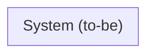

# Use case diagram:  (to-be)

Actors outside the boundary; dashed arrows are «include» and «extend».

```mermaid
flowchart LR
  subgraph system["System (to-be)"]
  end
```

| Use case | Actors | Spec | Status |
|---|---|---|---|
